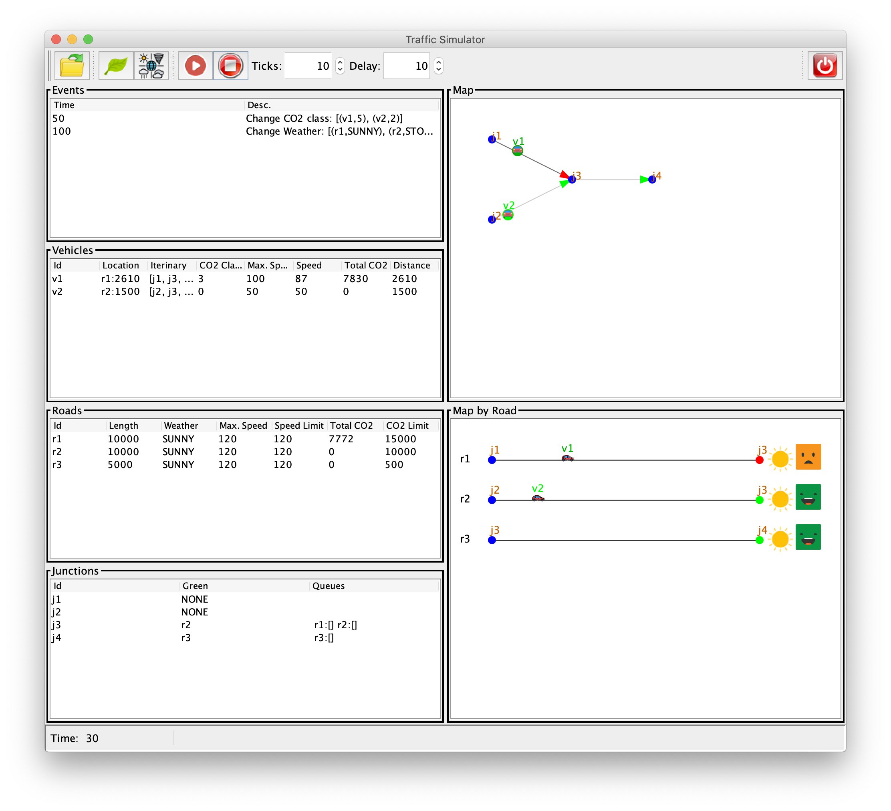

# Práctica 3: Mejora de la GUI utilizando hilos

## Introducción

En la práctica 2, hemos descrito dos enfoques para implementar la funcionalidad de los botones   y  

1. En el primero, utilizamos la cola de eventos de Swing para realizar la llamada recursiva a **run_sim**, y de este modo, entre una llamada y otra a `_ctrl.run(1)` Swing puede actualizar la vista y manejar las interacciones con el usuario.

2. En el segundo, sugerimos cambiar el método **run_sim** para simplemente llamar a `_ctrl.run(n)`, en cuyo caso la vista permanece bloqueada mientras el simulador se está ejecutando y solo vemos el resultado final.

Aunque hemos logrado un comportamiento razonable con el primer enfoque, teniendo en cuenta la capacidad de respuesta, podemos mejorarlo si utilizamos programación multihilo, que es lo que haremos en esta práctica.

## Utilizar Hilos en Java para Proporcionar Capacidad de Respuesta en la GUI

  
*Figura 1: La GUI*

Cambia el panel de control para incluir un nuevo **JSpinner** _Delay_ (con un valor mínimo de 0, valor máximo 1000 y tamaño de paso 1) y una etiqueta correspondiente; consultA la Figura 1. Su valor representa un retardo entre pasos de simulación consecutivos, ya que ahora la ejecución será más rápida.

Cambia el método **run_sim** para incluir un segundo parámetro **delay** de tipo **long**, y a continuación cambia su cuerpo a algo parecido al siguiente pseudocódigo:

```java
while ( n > 0 && (the current thread has not been interrupted) ) {
  // 1. execute the simulator one step, i.e., call method
  //    _ctrl.run(1) and handle exceptions if any
  // 2. sleep the current thread for 'delay' milliseconds
  n--;
}
```

Este bucle ejecuta n pasos del simulador, pero se detiene si el hilo correspondiente ha sido interrumpido. En el paso 1, ejecuta el simulador un solo paso y captura cualquier excepción lanzada por el simulador/controlador, preséntala al usuario utilizando un cuadro de diálogo y sal del método `run_sim` inmediatamente (como en la práctica 2). En el paso 2, usa `Thread.sleep` para dormir el hilo actual durante _delay_ milisegundos.

Recuerda que si un hilo se interrumpe mientras duerme, el flag de interrupción no se establece a `true`, sino que se lanza una excepción. Por lo tanto, en tal caso, se debe interrumpir nuevamente el hilo actual al capturar la excepción correspondiente para salir del bucle (o simplemente salir del método con `return`).

A continuación, cambia la funcionalidad de los botones   y   para ejecutar **run_sim** en un nuevo hilo de la siguiente manera:

- Añade en la clase **ControlPanel** un nuevo atributo llamado **_thread** del tipo `java.util.Thread`, y hazlo **volatile** ya que será modificado desde distintos hilos.

- Cuando se haga clic en , desactiva todos los botones salvo  y crea un nuevo hilo (asigna esa referencia a **_thread**) que hará lo siguiente:  
  (1) Llama a **run_sim** con el número de pasos y el delay especificados en los correspondientes componentes **JSpinner**.  
  (2) Habilita todos los botones, es decir, cuando termine la llamada a **run_sim**.

- Cuando se haga clic en , si hay un hilo ejecutándose, es decir, si **_thread** es distinto de `null`, entonces interrúmpelo para salir del bucle `while` y de este modo termina el hilo.

Observar que la misma funcionalidad se puede implementar utilizando el atributo **_stopped**, que hemos utilizado en la práctica 2, en lugar de la interrupción de hilos. En tal caso, se debe declarar **_stopped** como **volatile**. Sin embargo, queremos que practiques las interrupciones de hilos y, por lo tanto, no utilices una solución basada en el atributo **_stopped** (elimina este campo de la clase **ControlPanel**).

Cambia los métodos de observador, en todas las clases de la vista, de modo que cada vez que se modifique un campo o un componente Swing, se realice utilizando `SwingUtilities.invokeLater`. Esto es necesario ya que los métodos de observador ahora se ejecutan en un hilo distinto al hilo de Swing. Lo mismo se debe hacer cuando mostramos mensajes de error en el método **run_sim**.

## Opcional

Implementa la funcionalidad descrita en la sección anterior utilizando un **SwingWorker** en lugar de crear un nuevo hilo cada vez que se haga clic en .
