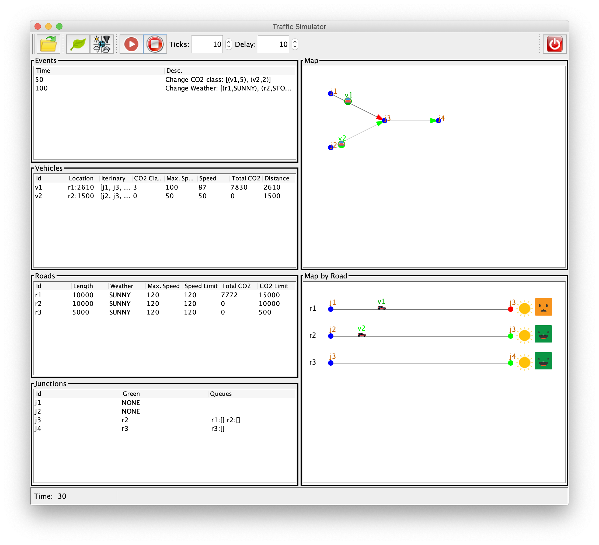

# Assignment 3: Improving the GUI Responsivity using Threads

## Overview

In assignment 2, we have described two approaches for implementing the functionality of the buttons  and :

1. In the first, we used the events queue of `Swing` in order to perform the recursive calls to `run_sim`, and thus, between one call and another to `_ctrl.run(1)` Swing could refresh the view and handle interactions with the user.
2. In the second, we suggested to change method `run_sim` to simply call `_ctrl.run(n)`, in which case the view remains blocked while the simulator is executing and we only see the final result.

Although we have achieved a reasonable behaviour with the first approach, when taking responsivity into account, we can even do better if we use multithreaded programming, which is what we will do in this assignment.

## Using Java Threads to Improve Responsivity of the GUI



Change the control panel to include a new *Delay* `JSpinner` (with minimum value 0, maximum value 1000, and step size 1) and a corresponding label -- see the figure above. Its value represents a delay between consecutive simulation steps, since now the execution will be faster.

Change method `run_sim` to include a second parameter `delay` of type `long`, and then change its body to something like the following pseudo code:

```java
while (n > 0 && !Thread.currentThread().isInterrupted()) {
    // 1. execute the simulator one step, i.e., call method
    //    _ctrl.run(1) and handle exceptions if any
    // 2. sleep the current thread for 'delay' milliseconds
    n--;
}
```

This loop executes the simulator `n` steps, but it stops if the corresponding thread has been interrupted.

In step 1, execute the simulator a single step and catch any exception that is thrown by the simulator/controller and present it to the user using a dialog-box and exit method `run_sim` immediately (as in assignment 2).

In step 2, use `Thread.sleep` to sleep the current thread for `delay` milliseconds. Recall that if a thread is interrupted while sleeping, the interruption flag is not set to `true` but rather an exception is thrown. Thus, in such case, you should interrupt the current thread again when catching the corresponding exception in order to exit the loop (or simply exit the method using `return`).

Next, change the functionality of buttons  and  in order to execute `run_sim` in a new thread as follows:

- Add a new field called `_thread` of type `java.lang.Thread` to the class `ControlPanel`, and make it `volatile` since it will be changed from different threads.

- When  is clicked, disable all buttons except  and create a new thread (and assign the reference to `_thread`) that does the following:

  1. Calls `run_sim` with the number of steps and delay as specified in the corresponding `JSpinner` components.
  2. Enables all buttons, i.e., when coming back from `run_sim`.
  3. Assign `null` to `_thread`.

- When  is clicked, if there is a thread running, i.e., `_thread` is different from `null`, then interrupt it in order to exit the while loop and thus terminate the thread.

Note that the same functionality can be implemented using the `_stopped` field, that we have used in assignment 2, instead of thread interruption. In such case you should declare `_stopped` as `volatile`. However, we want that you practice thread interrupts and thus do not use a solution that is based on the `_stopped` field -- remove this field from the class `ControlPanel`.

Change the observer methods, in all classes of the view, such that whenever a field or a `Swing` component is modified, it is done using `SwingUtilities.invokeLater`.

This is needed since the observer methods are now executing in a thread that is different from the *event dispatching thread* of `Swing`. The same should be done when showing error messages in method `run_sim`.

## Optional

Implement the functionality described in the previous section using a `SwingWorker` instead of creating a new thread every time  is clicked.

